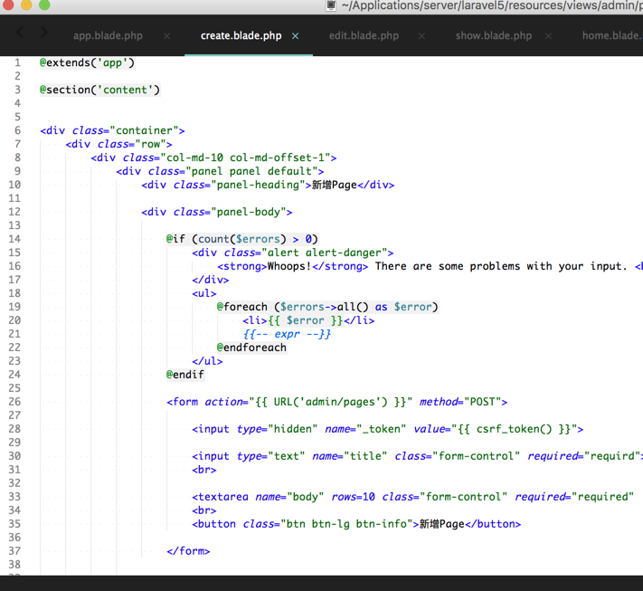
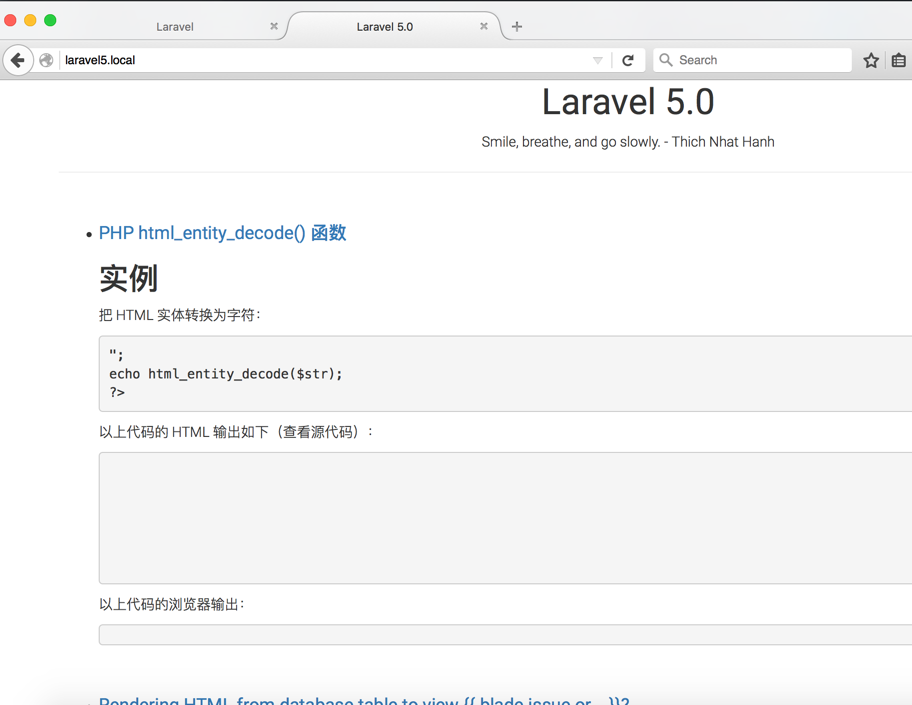

Laravel 5.0 学习笔记
==

@(学习笔记)

Laravel 框架是PHP编程领域最流行的开发框架，近几年受到国内、国外开发者大力推荐，研究了近一周的时间，发现确实非常棒。以前使用ThinkPHP、Symfony1真正做过实际项目，虽然在Laravel中很多新概念，新名词，不过其核心组件还加载了Symfony框架，大部分知识点也都类似Symfony。因此，上手也就不那么“高端”了。

----
在学习Laravel前， 自己先查询了关于Laravel的中文资料，并收集到了[Github](https://github.com/Brave-Cheng/Materials/blob/master/Online/Laravel.md)，希望资料也能帮助到想，打算，正在学习Laravel框架的开发者。 也总结一下，自己的学习心得，先通读一遍**Laravel 安装指南**， 然后看看一个学生的Laravel基础视频教程**Laravel-5-Basic 视频学习资料**，最后跟着**Laravel 5 系列入门教程（一）【最适合中国人的 Laravel 教程】**这篇博文做做实际开发。

----
最后，共享一下我的Github源码-Laravel-5.0-Learning，它是一个简易的博客系统，包含后台管理，账号注册与登录、博文发布，博文评论等功能，为什么单独说明下该源码呢？我大概整理了下该源码所包含的内容

+ 核心要点
	+ 原生[Laravel5.0.22](https://github.com/laravel/laravel/tree/v5.0.22)支持
	+ [Simditor - 项目管理应用Tower推荐富文本编辑器](https://github.com/mycolorway/simditor)
	+ Bootstrap原生支持
	+ Vagrant 项目开发环境构建工具

参考学习资源

+ https://github.com/Brave-Cheng/Materials/blob/master/Online/Laravel.md

效果概览

